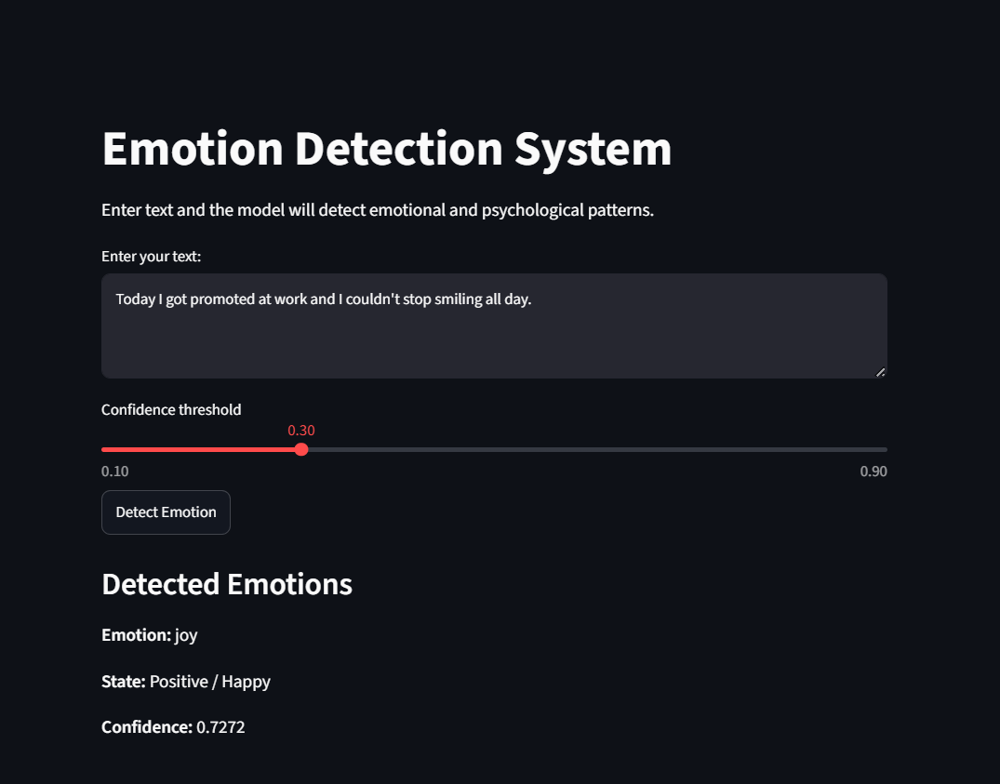
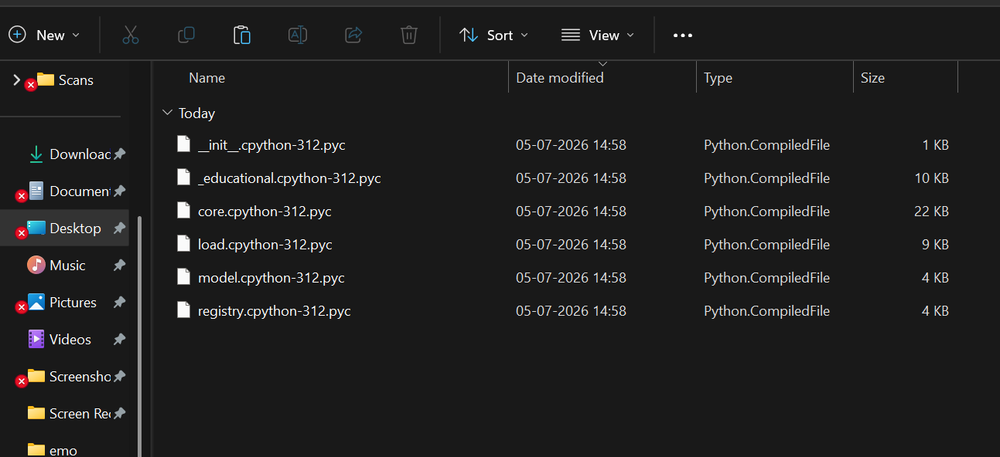

# Emotion Detection System using DistilBERT

## Overview

This project is a multi-label Emotion Detection System built using **DistilBERT** and fine-tuned on the **GoEmotions** dataset. The model predicts multiple emotions from user-provided text and displays the detected emotions along with their confidence scores through a Streamlit web interface.

This project demonstrates the complete NLP workflow including data preprocessing, transformer fine-tuning, model evaluation, and deployment with Streamlit.

---

## Features

- Multi-label emotion classification
- Fine-tuned DistilBERT model
- Interactive Streamlit web application
- Adjustable confidence threshold
- Displays multiple detected emotions
- Confidence score for each prediction
- Easy-to-use interface

---

## Technologies Used

- Python
- PyTorch
- Hugging Face Transformers
- DistilBERT
- GoEmotions Dataset
- Streamlit
- Scikit-learn
- Pandas
- NumPy

---

## Project Structure

```
Emotion-Detection-System/
│
├── images/
│   ├── app_home.png
│   └── multiple_emotion.png
│
├── app.py
├── README.md
├── requirements.txt
├── .gitignore
└── Clean_GoEmotions_DistilBERT_Colab_Notebook.ipynb

---

A multi-label emotion detection system built using **DistilBERT**, fine-tuned on the **GoEmotions** dataset. The application predicts one or more emotions from user input through an interactive Streamlit interface.
```
---
A multi-label emotion detection system built using **DistilBERT**, fine-tuned on the **GoEmotions** dataset. The application predicts one or more emotions from user input through an interactive Streamlit interface.

## Application Preview

### Home Screen



### Multiple Emotion Detection



---

## Dataset

The model is trained using Google's **GoEmotions** dataset containing **28 emotion classes**.

Examples of emotions include:

- Joy
- Anger
- Fear
- Sadness
- Love
- Surprise
- Gratitude
- Optimism
- Remorse
- Pride
- Neutral
- and more...

---

## Installation

Clone the repository

```bash
git clone https://github.com/alankritimehra/Emotion-Detection-System.git
```

Go inside the project folder

```bash
cd Emotion-Detection-System
```

Install dependencies

```bash
pip install -r requirements.txt
```

---

## Running the Application

```bash
streamlit run app.py
```

Then open

```
http://localhost:8501
```

---

## Model

The trained DistilBERT model is **not included in this repository** because GitHub has a file size limit of 100 MB.

Download the trained model and place it inside:

```
emotion_model/
```

---

## Example

Input:

```
I was terrified before the interview, but after getting selected I felt relieved, excited, and grateful.
```

Output:

```
Gratitude
Relief
Excitement
Optimism
```

---
## Trained Model

The trained DistilBERT model is not included in this repository because GitHub has a file size limit of 100 MB.

You can download the trained model from the link below:

**Google Drive:**  
https://drive.google.com/file/d/1SzDSv2X6Xo_-jOVNmlyVZxWyRCiMXyPu/view?usp=sharing

### How to use the model

1. Download the ZIP file from the Google Drive link above.
2. Extract the ZIP file.
3. Place the extracted `emotion_model` folder inside the project directory.

Your project structure should look like:

```
Emotion-Detection-System/
│
├── app.py
├── requirements.txt
├── README.md
├── emotion_model/
│   ├── config.json
│   ├── model.safetensors
│   ├── tokenizer.json
│   ├── tokenizer_config.json
│   └── training_args.bin
│
└── Clean_GoEmotions_DistilBERT_Colab_Notebook.ipynb
```

Then run:

```bash
pip install -r requirements.txt
streamlit run app.py
```

## Future Improvements

- Deploy on Hugging Face Spaces
- Improve model accuracy
- Add probability charts
- Support batch predictions
- Export prediction reports
- Real-time API deployment

---

## Disclaimer

This project is intended for educational and research purposes only.

The model predicts emotional patterns from text and **should not be used for medical or psychological diagnosis**.

---
## Project Highlights

- Fine-tuned DistilBERT on Google's GoEmotions dataset
- Detects 28 different emotions
- Multi-label emotion classification
- Interactive Streamlit web application
- Confidence threshold adjustment
- Built using PyTorch and Hugging Face Transformers


## Author

**Alankriti Mehra**

GitHub: https://github.com/alankritimehra
